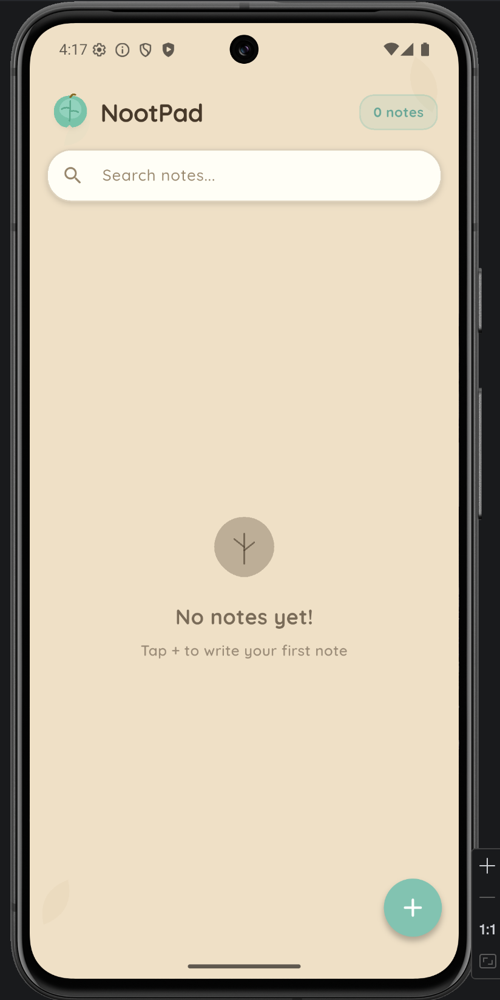

# NootPad (previously Chinta Ultimate)

A cozy, pastel-themed note-taking app built with Flutter. Warm sandy tones, soft colors, and rounded UI elements make jotting down thoughts feel delightful.

## Screenshots




## Features

- **Create, edit & delete** notes with a clean, minimal editor
- **Pin** important notes to the top
- **Color-code** notes with 8 pastel colors
- **Organize** with categories (General, Personal, Work, Ideas, Shopping, Recipes, or create your own)
- **Search** across titles and content
- **Filter** by category with scrollable chips
- **Masonry grid** layout for a natural, staggered look
- **Local storage** with SQLite - your notes stay on your device

## Tech Stack

| Layer | Tool |
|---|---|
| Framework | Flutter (Dart) |
| State Management | Provider |
| Database | sqflite (SQLite) |
| Typography | Google Fonts (Quicksand) |
| Layout | flutter_staggered_grid_view |

## Getting Started

```bash
# Clone the repo
git clone https://github.com/RiceSouffle/nootpad.git
cd nootpad

# Install dependencies
flutter pub get

# Run the app
flutter run
```

## Project Structure

```
lib/
  main.dart                        # App entry point
  models/
    note.dart                      # Note data model
  services/
    database_service.dart          # SQLite persistence
  providers/
    notes_provider.dart            # State management
  theme/
    app_theme.dart                 # Colors, theme, decorations
  screens/
    home_screen.dart               # Main notes grid
    edit_note_screen.dart          # Note editor
  widgets/
    note_card.dart                 # Pastel note card
    app_search_bar.dart            # Search bar
    color_picker.dart              # Note color selector
    category_chip.dart             # Category filter chip
    leaf_painter.dart              # Custom leaf logo & decorations
```

## License

MIT
