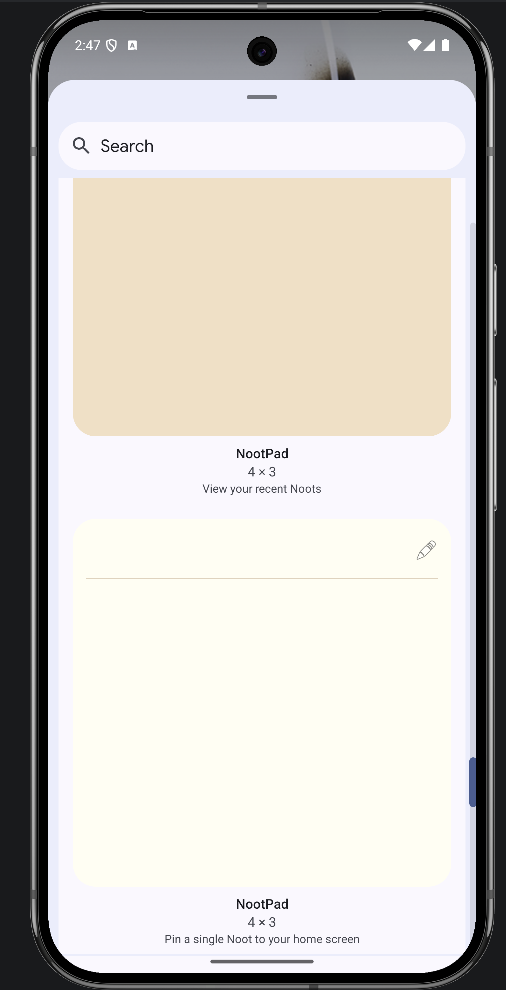
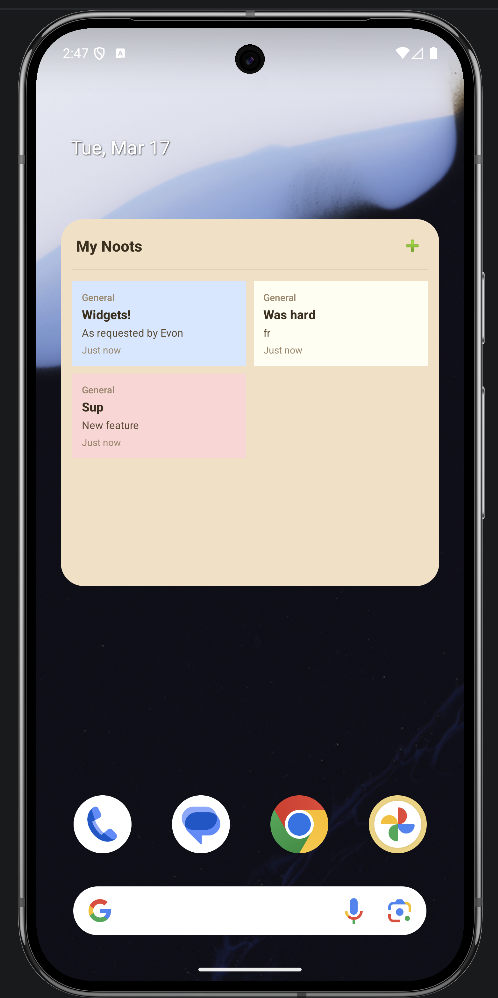
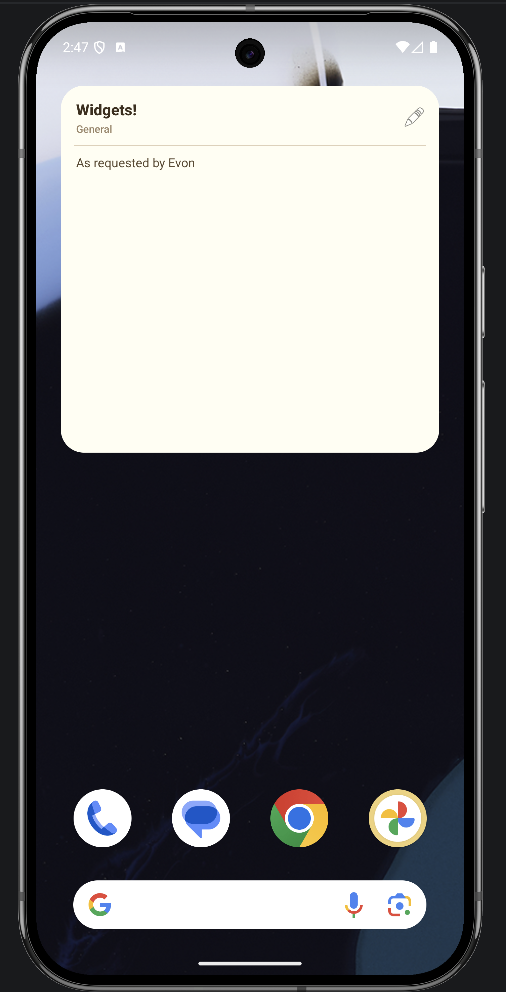
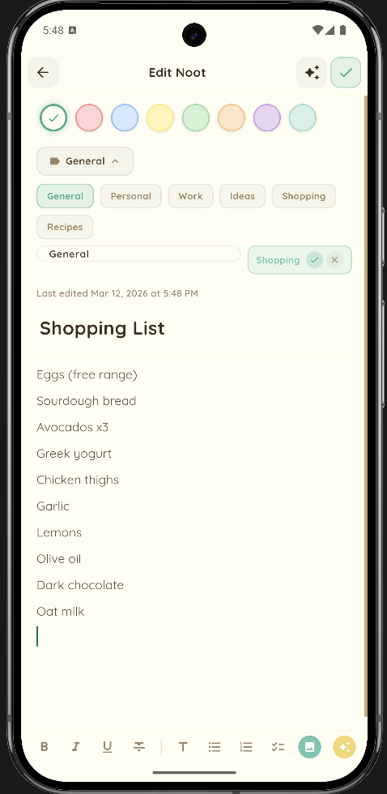
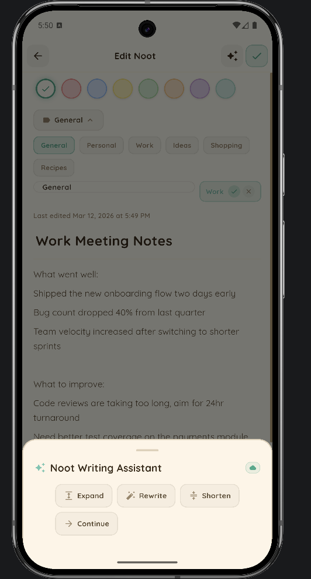
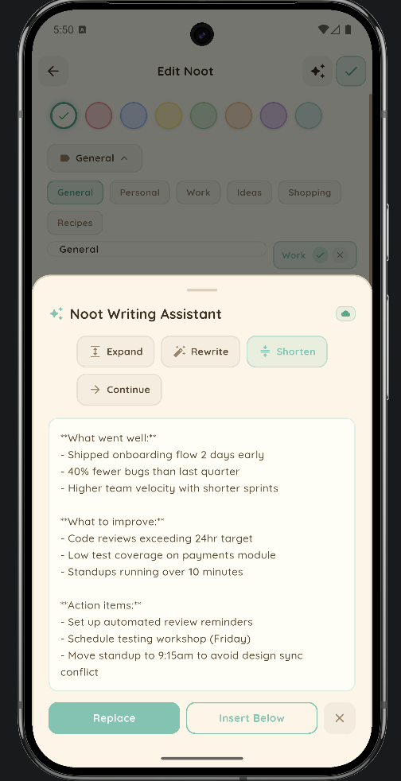
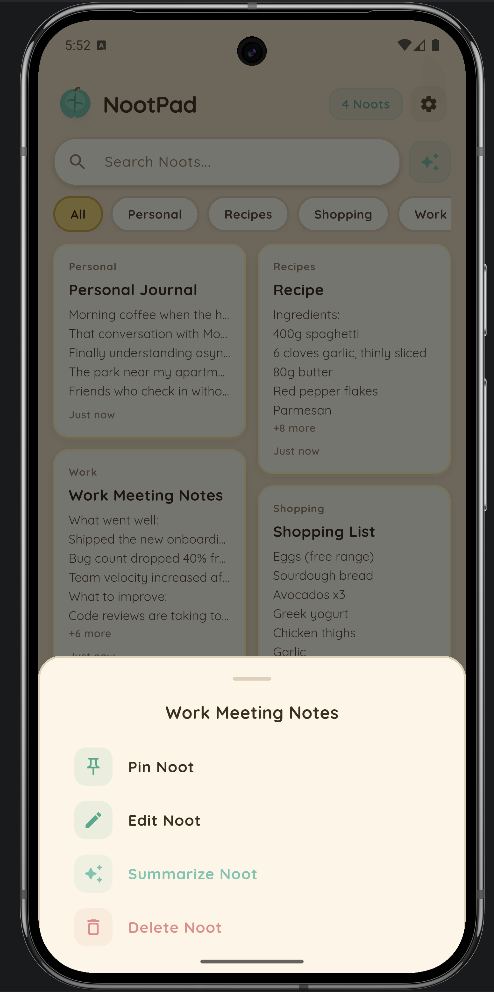
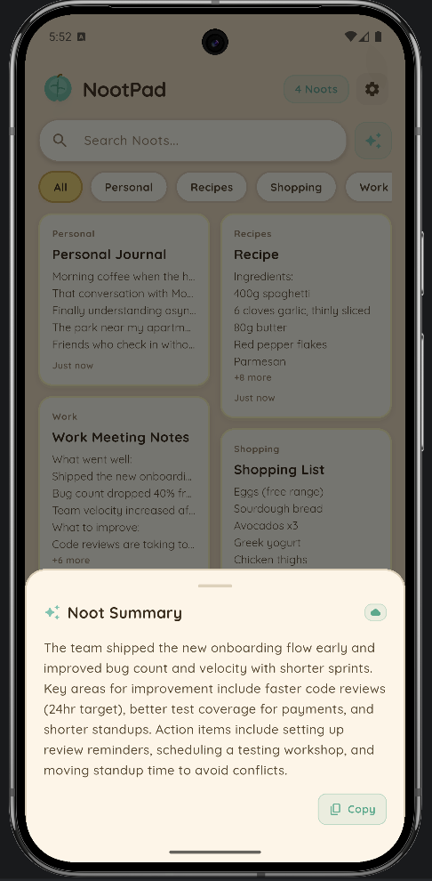
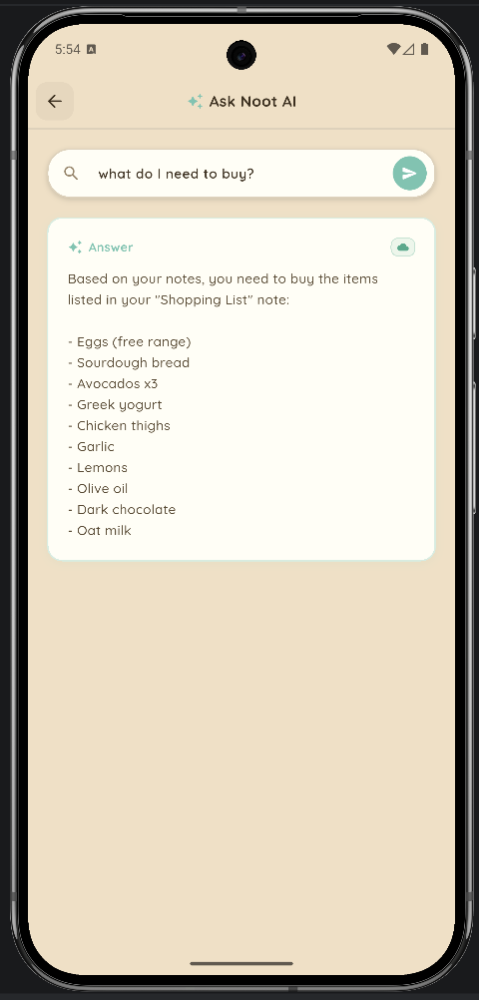
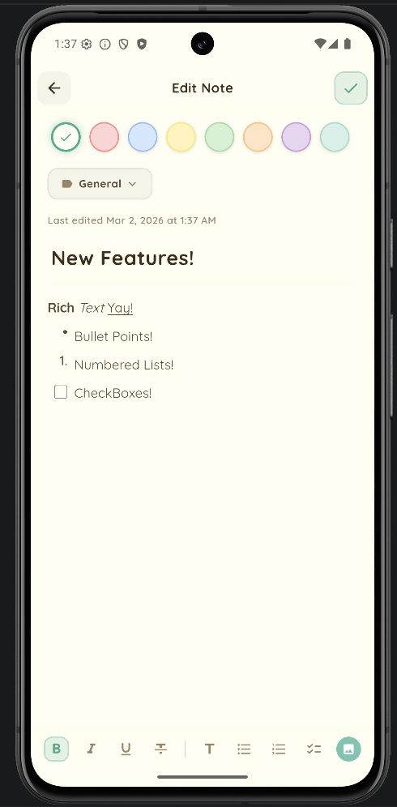

# NootPad

**A beautifully crafted note-taking app that makes organizing your thoughts feel like a joy, not a chore.**

NootPad combines a warm, pastel aesthetic with intuitive functionality — creating a note-taking experience that users actually *want* to come back to.

## Screenshots

<p align="center">
  
  
  
</p>
<p align="center">
  
  
  
</p>

## Why NootPad?

Most note apps feel cold and utilitarian. NootPad takes a different approach — warm sandy tones, soft pastel note cards, and a handcrafted leaf logo create an experience that feels personal and inviting. It's the note app you'd find on a cozy island getaway.

## Key Features

**Effortless Organization**
- Pin important notes to the top for quick access
- Color-code with 8 pastel colors at a glance
- Categorize with built-in or custom categories

**Powerful & Simple**
- Full-text search across all notes
- Filter by category with one tap
- Beautiful masonry grid that adapts to your content

**Noot AI — Your Smart Writing Companion**
- Summarize any note into 2–3 key sentences
- AI writing assistant: expand, rewrite, shorten, or continue your text
- Smart category suggestions based on note content
- Ask questions about your notes — AI searches across all your Noots

**Privacy First**
- All data stored locally on-device with SQLite
- No accounts, no cloud, no tracking
- Your notes are yours alone
- AI features are opt-in — notes are only sent when you tap an AI action
- API key stored securely on-device via encrypted storage

## Tech Stack

| Layer | Tool |
|---|---|
| Framework | Flutter (Dart) — single codebase for iOS & Android |
| Rich Text Editor | flutter_quill (Quill Delta) |
| State Management | Provider |
| Database | sqflite (SQLite) |
| AI | Anthropic Claude API via HTTP |
| Secure Storage | flutter_secure_storage (API key encryption) |
| Home Screen Widgets | home_widget + native Android RemoteViews |
| Images | image_picker + path_provider |
| Typography | Google Fonts (Quicksand) |
| Layout | flutter_staggered_grid_view |

## Architecture

```
lib/
  main.dart                        # App entry point (MultiProvider + lifecycle observer)
  models/
    note.dart                      # Note data model (plain + Delta formats)
  services/
    database_service.dart          # SQLite persistence layer (v2 schema)
    widget_service.dart            # Home screen widget data sync + background callbacks
    image_service.dart             # Gallery/camera image handling
    ai_service.dart                # AI backend routing (Claude API)
    ai_prompts.dart                # Prompt templates for all AI features
    settings_service.dart          # Secure API key storage
  providers/
    notes_provider.dart            # Reactive state + checklist toggling + widget sync
    ai_provider.dart               # AI feature state (summarize, write, categorize, Q&A)
  utils/
    delta_parser.dart              # Shared Quill Delta parser (lines, checklists, plain text)
  theme/
    app_theme.dart                 # Design system (colors, theme, decorations)
  screens/
    home_screen.dart               # Main notes grid view
    edit_note_screen.dart          # Rich text editor with formatting toolbar
    settings_screen.dart           # API key config + AI status + privacy info
    ai_search_screen.dart          # Ask questions about your notes
  widgets/
    note_card.dart                 # Rich text preview + interactive checkboxes
    app_search_bar.dart            # Search bar
    color_picker.dart              # Note color selector
    category_chip.dart             # Category filter chip
    leaf_painter.dart              # Custom-painted leaf logo & decorations
    ai_summary_sheet.dart          # Note summarization bottom sheet
    ai_writing_sheet.dart          # Writing assistant bottom sheet
    ai_category_suggestion.dart    # Smart category suggestion chip
    ai_status_indicator.dart       # AI backend status badge

android/app/src/main/kotlin/com/sef/nootpad/
  NoteCollectionWidgetProvider.kt  # Recent notes grid widget
  NoteCollectionRemoteViewsService.kt  # Grid item data factory
  SingleNoteWidgetProvider.kt      # Single note widget with checklist
  SingleNoteRemoteViewsService.kt  # Checklist item data factory
  WidgetConfigActivity.kt          # Native note picker for widget setup
```


## What's New

**v1.3 — Home Screen Widgets**

Your Noots now live on your home screen. Two new Android widgets bring your notes front and center — no need to open the app.

- **Recent Noots Widget** — A 2-column grid showing your latest notes with color-coded cards. Tap any note to jump straight into the editor, or tap "+" to create a new Noot
- **Single Noot Widget** — Pin any individual note to your home screen. Displays the title, content preview, and interactive checklist items
- **Interactive Checklists** — Check off items directly from the home screen widget — no need to open the app. Changes sync bidirectionally between the widget and the app
- **Native Note Picker** — Clean, native Android configuration screen lets you choose which Noot to pin when adding a Single Noot widget
- **Bidirectional Sync** — Edit a note in the app and the widget updates automatically. Toggle a checklist on the widget and it's saved to the database instantly
- **Background Processing** — Widget interactions are handled via a background Dart isolate, so everything stays fast and responsive

<p align="center">
  
  
  
</p>

---

**v1.2 — Noot AI**

Your notes just got smarter. NootPad now features a full AI assistant powered by Anthropic Claude — all while keeping your privacy intact.

- **Summarize** — Long-press any note or tap the sparkle icon in the editor to get a concise 2–3 sentence summary
- **Writing Assistant** — Select text and choose Expand, Rewrite, Shorten, or Continue Writing. Preview the result, then Replace or Insert Below
- **Smart Categories** — Tap "Suggest" in the category selector and AI will recommend the best category based on your note's content
- **Ask Noot AI** — A dedicated Q&A screen where you can ask questions across all your notes. AI searches your Noots and tells you which ones have the answer
- **Settings Screen** — New settings page to manage your Anthropic API key, view AI status, and review privacy info
- **Graceful Degradation** — No API key? AI buttons show a friendly setup prompt instead of breaking

<p align="center">
  
  
  
</p>
<p align="center">
  
  
  
</p>

---

**v1.1 — Rich Text & Checklists**
- Full rich text editor powered by Quill — bold, italic, underline, strikethrough, headings
- Interactive checklists you can tick off right from the homepage, no need to open the note
- Bullet and numbered lists
- Inline images from gallery or camera
- Rich formatting previews on note cards — what you write is what you see
- Custom app icon featuring the NootPad leaf logo

<p align="center">
  
</p>

## Getting Started

```bash
git clone https://github.com/RiceSouffle/nootpad.git
cd nootpad
flutter pub get
flutter run
```

## License

MIT

