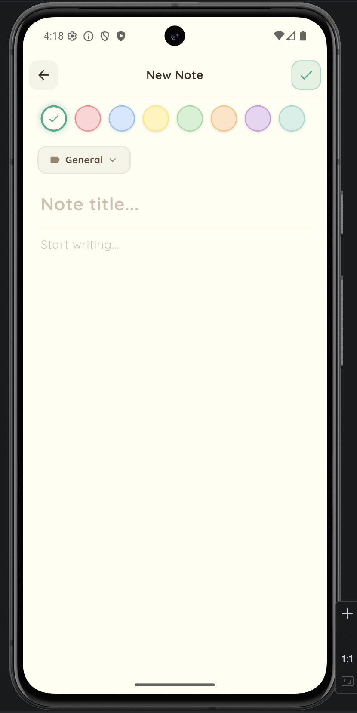
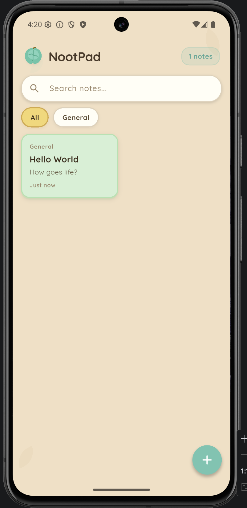
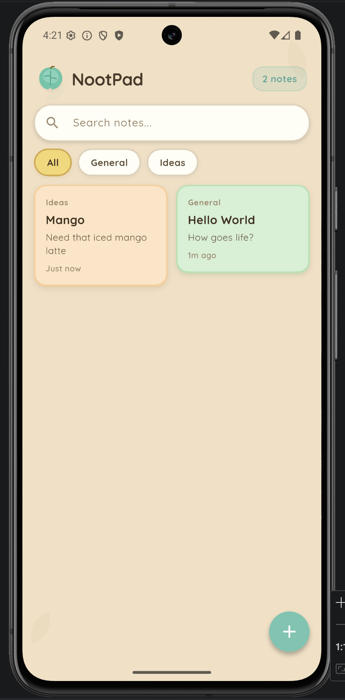
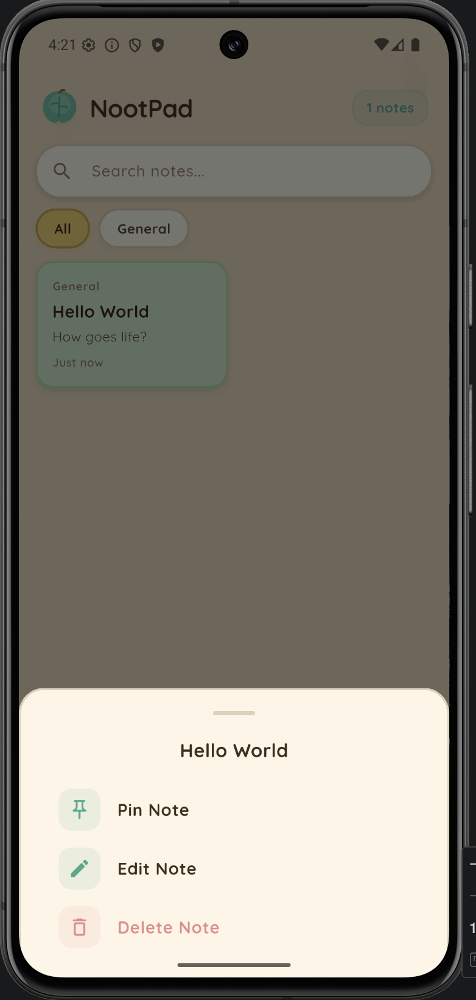
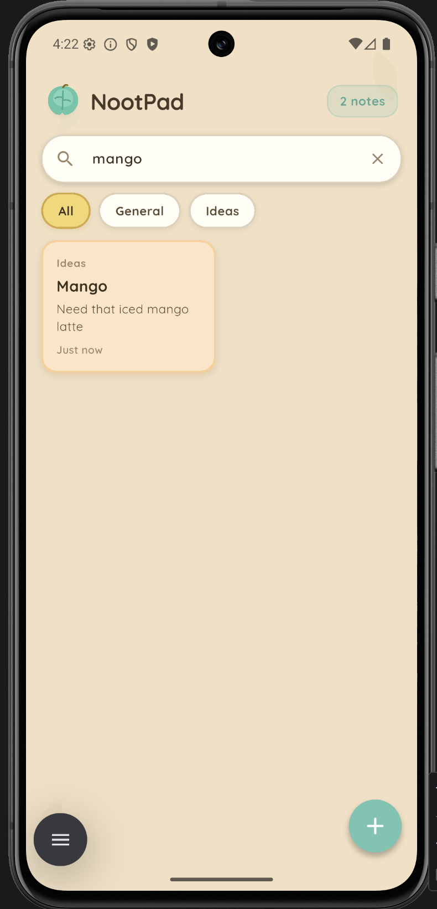

# NootPad

**A beautifully crafted note-taking app that makes organizing your thoughts feel like a joy, not a chore.**

NootPad combines a warm, pastel aesthetic with intuitive functionality — creating a note-taking experience that users actually *want* to come back to.

## Screenshots

<p align="center">
  
  
  
</p>
<p align="center">
  
  
  
</p>


## Why NootPad?

Most note apps feel cold and utilitarian. NootPad takes a different approach — warm sandy tones, soft pastel note cards, and a handcrafted leaf logo create an experience that feels personal and inviting. It's the note app you'd find on a cozy island getaway.

## Key Features

**Effortless Organization**
- Pin important notes to the top for quick access
- Color-code with 8 pastel colors at a glance
- Categorize with built-in or custom categories

**Powerful & Simple**
- Full-text search across all notes
- Filter by category with one tap
- Beautiful masonry grid that adapts to your content

**Privacy First**
- All data stored locally on-device with SQLite
- No accounts, no cloud, no tracking
- Your notes are yours alone

## Tech Stack

| Layer | Tool |
|---|---|
| Framework | Flutter (Dart) — single codebase for iOS & Android |
| State Management | Provider |
| Database | sqflite (SQLite) |
| Typography | Google Fonts (Quicksand) |
| Layout | flutter_staggered_grid_view |

## Architecture

```
lib/
  main.dart                        # App entry point
  models/
    note.dart                      # Note data model
  services/
    database_service.dart          # SQLite persistence layer
  providers/
    notes_provider.dart            # Reactive state management
  theme/
    app_theme.dart                 # Design system (colors, theme, decorations)
  screens/
    home_screen.dart               # Main notes grid view
    edit_note_screen.dart          # Note creation & editing
  widgets/
    note_card.dart                 # Pastel note card component
    app_search_bar.dart            # Search bar
    color_picker.dart              # Note color selector
    category_chip.dart             # Category filter chip
    leaf_painter.dart              # Custom-painted leaf logo & decorations
```


## Getting Started

```bash
git clone https://github.com/RiceSouffle/nootpad.git
cd nootpad
flutter pub get
flutter run
```

## License

MIT
